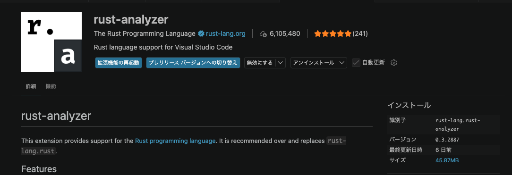
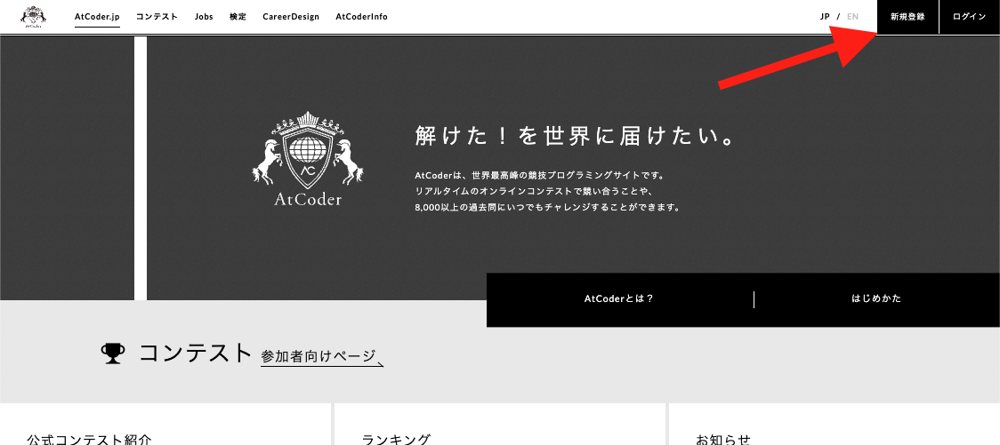
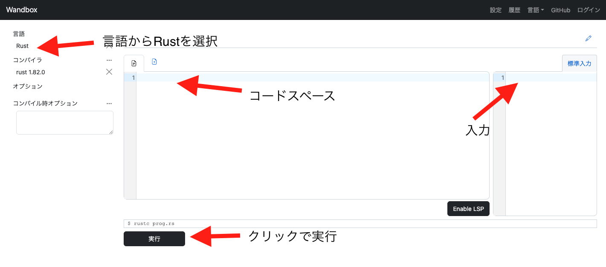

# セットアップ

## 用意するもの
- Rust
- VSCode + 拡張機能
- AtCorder登録

## Rustのインストール
1. MSVC C++ビルドツールをインストール

    下記サイトからMicrosoft C++ ビルド ツール をインストール

    https://visualstudio.microsoft.com/visual-cpp-build-tools/


2. C++ デスクトップ環境をインストール

    


1. コマンドを実行してrustupをインストール

    ```bash
    winget install Rustlang.Rustup
    ```

4. バージョン確認

    シェルを再起動してcargoのバージョンを確認できればRustのインストール完了！
    ```bash
    cargo version
    ~~~ 実行結果
    cargo 1.95.0 (f2d3ce0bd 2026-03-21)
    ```


## VSCode + 拡張機能

1. VSCodeのインストール
    
    下記のサイトの `Download for Mac` をクリックしてインストール

    https://code.visualstudio.com/


2. Rust拡張機能のインストール
    
    インストールする拡張機能
    - rust-analyzer




## AtCoder登録
AtCoderへアカウントを作成して問題を提出できるようにします。

1. 下記URLへアクセス

    https://atcoder.jp/home

2. 画面右上の `新規登録` をクリック
    


# Rust環境が用意できない場合

## オンライン実行環境(Wandbox)

https://wandbox.org/



