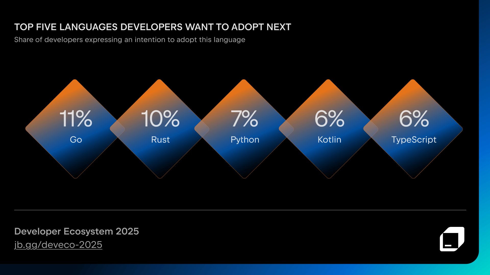
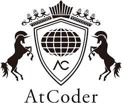
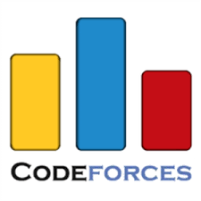
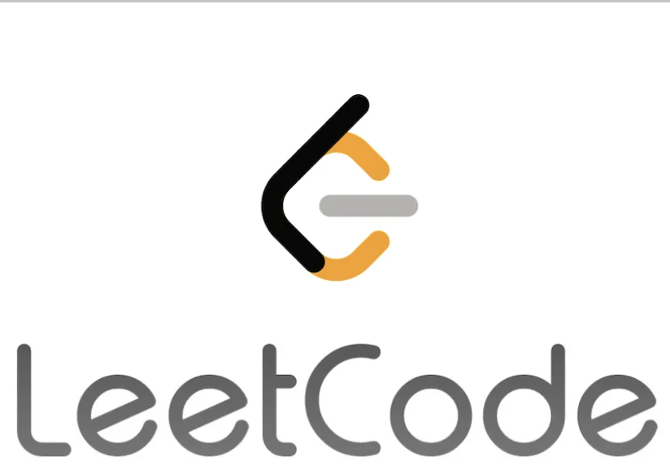
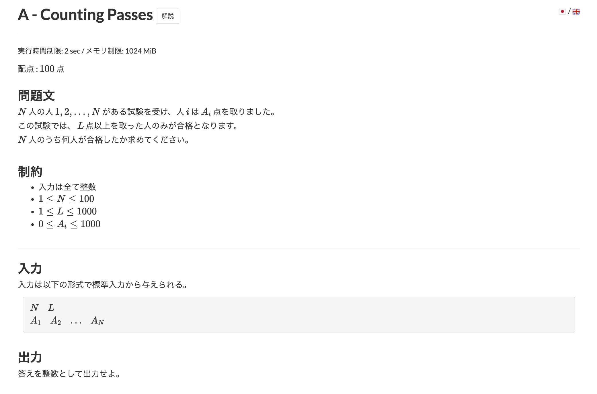
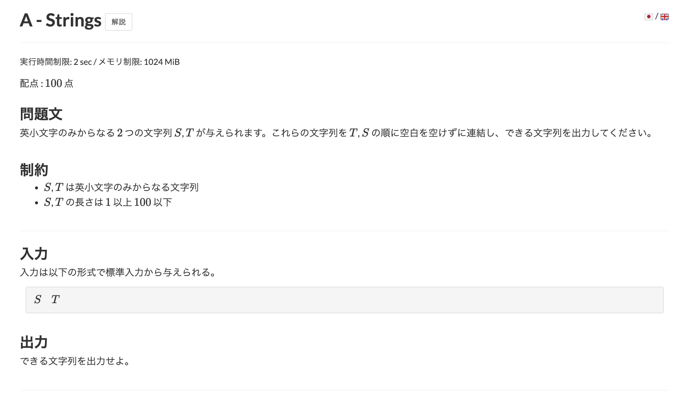
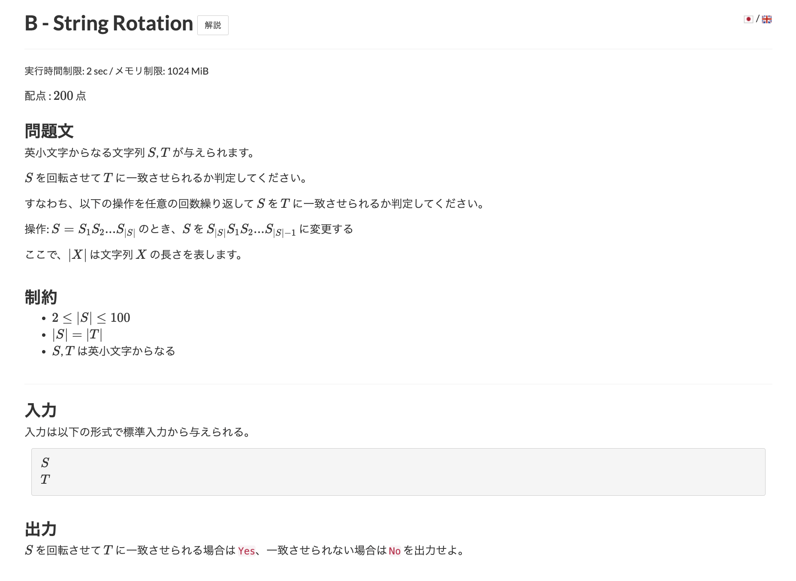

# Rustを始めよう！ついでに競プロも始めよう！
藤森 大地

---

# 本勉強会の目指すところ

- Rust面白い！と感じてもらう
- Rustを始める第一歩としてもらえたら

---

本日の流れ
- 解説
- 問題とく

<!-- 質問あったらどのタイミングでもしていいよと言う -->

---

# Rustとはどんな言語か


- 静的型付け言語
- コンパイル言語
- メモリ安全性を重視
- GCなしで高速
- コンパイルチェックが厳しい

<!-- まず -->
---

# Rustへの評価

開発者が次に採用したいと考えている上位5つのプログラミング言語に長年入っている



---

# 今日の題材について
# 競技プログラミング(AtCoder)ってなに？

---

# 競技プログラミングについて

決められた問題を、制限時間内にプログラムで解く競技。
下記のような問題が出る。

> 整数 N が与えられる。
1 から N までの合計を求めよ。

---

# 競技プログラミングについて

何を競うのか
- 制限時間内に実行できるか
- メモリ制限内に収まるか
- どれだけ早く解けるか

---

# これが出来ると何がいいのか

論理的思考、数学的な知識、計算量への意識、言語への理解が深まる

---

# 競技プログラミング有名所





AtCoder
CodeForces
LeetCode

---

# AtCoderについて

日本語向け競技プログラミングサービスの定番
わかりやすい回答解説も豊富

---

本日は、、、
AtCoderの問題を通してRustを学ぶぞ。

---

以下早速はじめて行こう！

---

# 事前準備
- Rustのインストール
- VSCode + Rust拡張のインストール
- AtCoderのアカウント作成

<!-- できた人は次のHelloWorldで動作確認 -->

---

# Hello World

```bash
cargo init project_name
```

```rust
fn main() {
    println!("Hello, world!");
}
```

```bash
cargo run
```

---

# 変数宣言

```rust
let x = 5; // 不変な変数
let mut y = 10; // 可変な変数
println!("x:{} y:{}", x, y);

x += 1;
y += 1;
println!("x:{} y:{}", x, y); // フォーマットして出力するprintの書き方
```


---

# 変数宣言

```bash
error[E0384]: cannot assign twice to immutable variable `x`
 --> src/main.rs:6:5
  |
2 |     let x = 5; // 不変な変数
  |         - first assignment to `x`
...
6 |     x += 1;
  |     ^^^^^^ cannot assign twice to immutable variable
  |
help: consider making this binding mutable
  |
2 |     let mut x = 5; // 不変な変数
  |         +++

For more information about this error, try `rustc --explain E0384`.
error: could not compile `demo_pro` (bin "demo_pro") due to 1 previous error
```

---

# 型について
静的型付け/動的型付け言語について説明。
i32, String型について説明

# Rustの基本の書き方

- 静的言語(プリミティブ？型について)
    - i32, f32, u32, usize
    - String, str, chr
- 変数宣言
- for
- if
- 標準入力

---

# if文

```rust
let n = 10;

if n % 2 == 0 {
    println!("nは偶数");
} else {
    println!("nは奇数");
}
```

---

# for文

```rust
let arr = [1, 2, 3, 4, 5]; // 配列(固定長)

for i in 0..5 {
    println!("{}", arr[i]);
}
```

---

```bash
cargo add proconio
```
```rust
use proconio::input;
fn main() {
    input! {
        n: usize,
        a_list: [i32; n],
    }

    for a in a_list {
        println!("{}", a);
    }
}
```
```input.txt
5
1 2 3 4 5
```
```bash
cargo run < input.txt
```

--- 

# 問題を解いてみよう！
mut, if, for

AtCoder ABCコンテスト 330 A問題
https://atcoder.jp/contests/abc330/tasks/abc330_a



---

回答

```rust
let mut count = 0;

for i in 0..n {
    if a_list[i] >= l {
        count += 1;
    }
}

println!("{}", count);
```


---

別解

```rust
for a in &a_list {
    if a >= l {
        count += 1;
    }
}
```

<!-- 添字を使わないなら基本こっち -->
<!-- 参照ではなく値を渡すと所有権が移るためもう使えなくなる？から気をつけて -->

---

# 速さについて多言語と比較
どの問題にするのか未決定
候補1 abc051_b 
    - 3重だとTLE(Rust)
    - 2重だと他の言語でもAC
⭕️候補2 abc162_c
    - 一応コードやオーダー的には3重
    - PythonのみTLE（Rust, PHP, Python, TS, JS）

---

# 所有権・借用について
代入と束縛(バインド)について

(図を入れる)

---

所有権とは
値を管理しているのが誰かを示す

---

# コードで説明

```rust
let s = String::from("Hello, world!"); // "Hello, world!".to_string()でもOK
println!("{}", s);

let s2 = s; // sの所有権がs2に移動する
println!("{}", s2);
// println!("{}", s); // エラー: sはs2に所有権が移動しているため、sは使用できない
```

<!-- 所有権のメリットはメモリ上の値と変数を1-1で紐づけられる。これにより解放しても良いメモリがコンパイル時に分かるので省メモリ実現。また思いがけない場所での値変更がない。 -->

---

同じ値を何回も使いたいが、所有権を消費してしまっているのでError（困った）

```rust
fn print_string(s: String) {
    println!("{}", s);
}

fn main() {
    let s = String::from("Hello, world!"); // "Hello, world!".to_string()でもOK
    
    print_string(s);
    // print_string(s); // エラー: sはprint_stringに所有権が移動しているため、sは使用できない
}
```

---

リファレンス(参照)を借用する

```rust
fn print_string_ref(s: &str) {
    println!("{}", s);
}

fn main() {
    let s = String::from("Hello, world!"); // "Hello, world!".to_string()でもOK
    
    print_string_ref(&s);
    print_string_ref(&s);
}
```

---

(図 p.62)

---

# 問題を解いてみよう！(２)
所有権, 借用, String

AtCoder ABCコンテスト 149 A問題
https://atcoder.jp/contests/abc149/tasks/abc149_a
AtCoder ABCコンテスト 103 B問題
https://atcoder.jp/contests/abc103/tasks/abc103_b




---

# 149Aの回答解説

```rust
println!("{}{}", t, s);
```

```rust
let ans = t + &s;
println!("{}", ans);
```

---

```rust
let ans = t + &s;
println!("{}", ans);

println!("{}", s);
println!("{}", t); // 所有権を持っていないのでErrorとなる
```

---

# Rustの文字列の2項演算について

Strign = String + &str

所有権が動く

---

# 103Bについて


回転した文字列のパターンについて
Sを2回繋げると全てのパターンが現れる！

---

# 103Bの回答解説

```rust
// sをコピーしないと所有権が移ってしまい参照が使えなくなってしまう。
let ss = s.clone() + &s;

if ss.contains(&t) {
    println!("Yes");
} else {
    println!("No");
}
```

---

# まとめ

所有権を中心に学びながら
Rustで問題を解いてみた

楽しいと思ってもらえたら

AtCoderの成績が全然振るわないので仲間増えたら嬉しいです！
